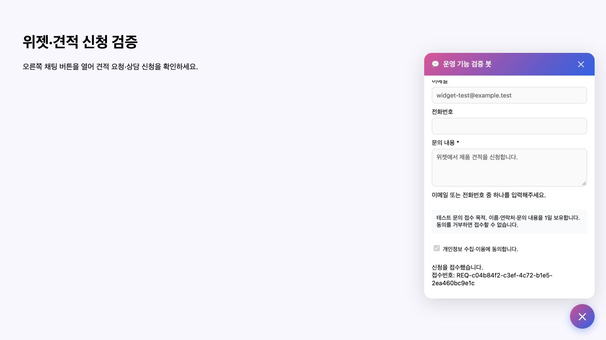
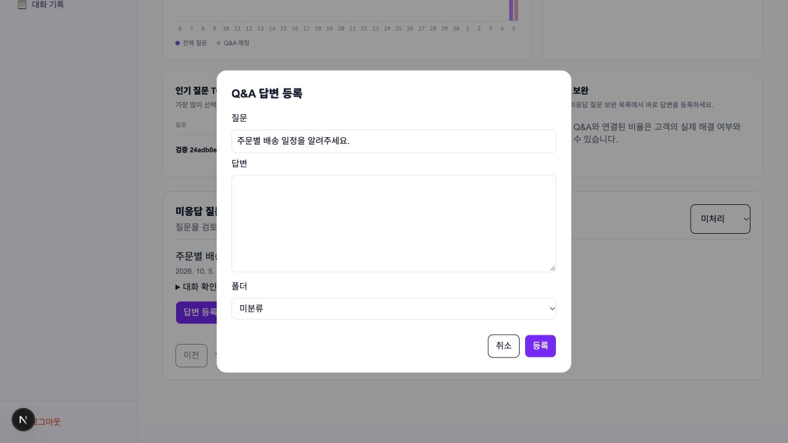
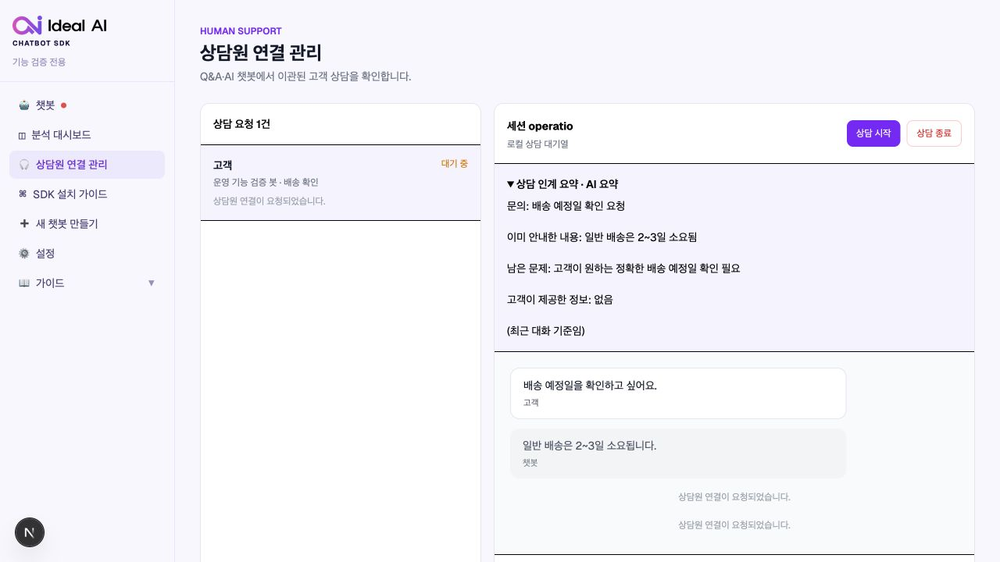
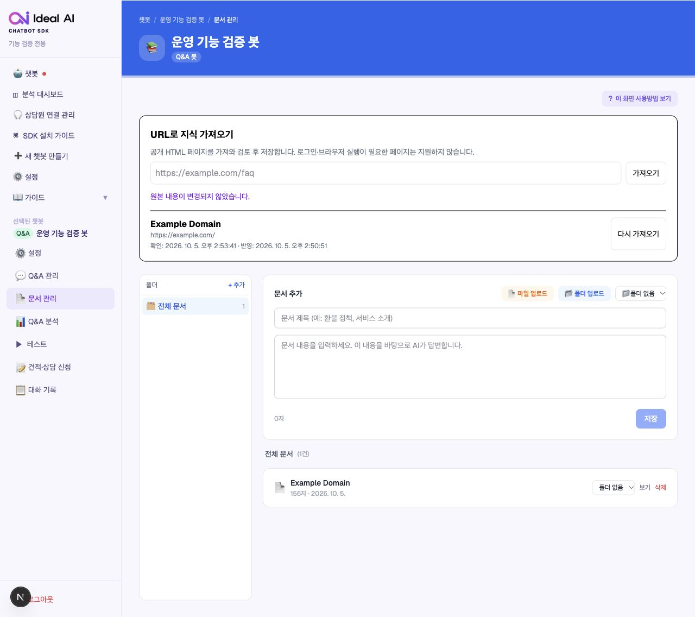
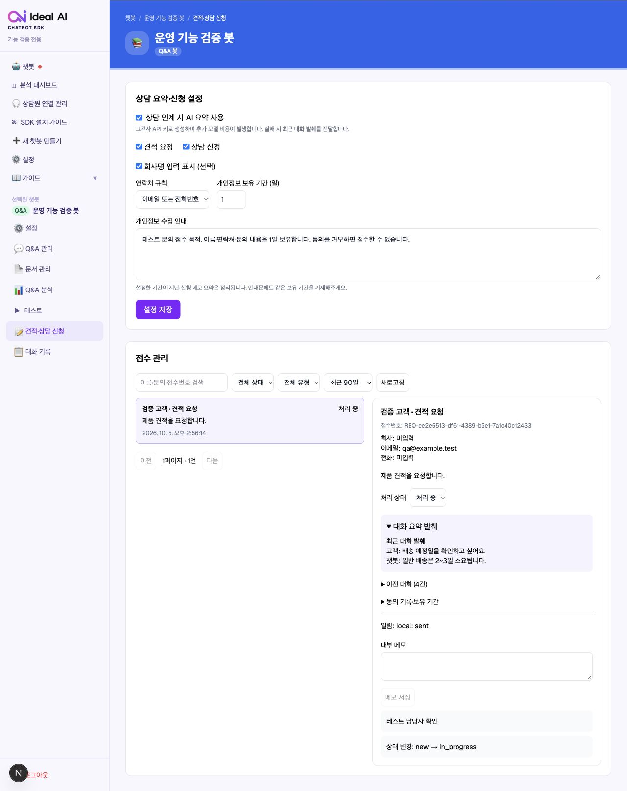
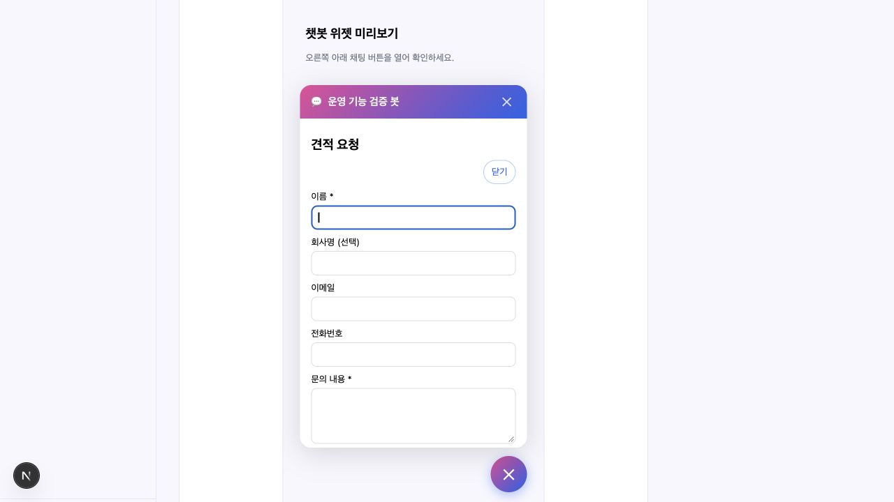

# 운영 기능 확장 확인 가이드

2026-10-05 작성. PRD의 첫 출시 범위 네 기능을 구현하고 로컬에서 검증했습니다. 운영 서비스 반영에는 배포가 필요합니다.

## 바로 확인하기

로컬 주소: [http://localhost:3001](http://localhost:3001)

본인 계정으로 로그인한 뒤 봇을 선택하세요. 개발 서버가 종료되었다면 저장소에서 `npm run dev -- --port 3001`로 실행합니다.

| 기능 | 확인할 화면 | 확인 순서 |
|---|---|---|
| 미응답 → Q&A | 봇 → Q&A 분석 → 미응답 질문 보완 | 질문 선택 → 답변 등록 → 테스트. 기존 동일 질문은 기존 Q&A에 연결 |
| 상담 인계 요약 | 봇 → 견적·상담 신청 → 요약 설정 / 전체 상담원 연결 관리 | AI 요약 활성화 → 위젯에서 상담 연결 → 상담 건의 요약과 원문 확인 |
| URL 지식 | 봇 → 문서 관리 → URL로 지식 가져오기 | 공개 HTML 주소 입력 → 미리보기 검토 → 반영 → 다시 가져오기 |
| 견적·상담 폼 | 봇 → 견적·상담 신청 | 폼 활성화·연락처 규칙·안내문 설정 → 실제 위젯 제출 → 접수 목록에서 상태·메모 변경 |

**실제 위젯은 봇의 테스트 화면 하단 ‘실제 위젯 미리보기’에서 열 수 있습니다.** 모바일 너비도 선택할 수 있습니다. 테스트 대화·신청은 실제 데이터로 저장되고, 연결된 채널이 있으면 알림이 전달될 수 있습니다.

처음에는 상담 요약과 신청 폼이 꺼져 있습니다. 고객사 설정에서 API 키를 등록하고 필요한 기능을 활성화하세요. Q&A 임베딩과 URL 문서 임베딩에는 OpenAI 키가 필요합니다. 상담 요약은 봇의 OpenAI/Gemini 공급자 설정을 따르며 키 없음·시간 초과 시 최근 대화 발췌로 대체합니다.

## 구현 내용

### 미응답 질문 보완

- 기간·처리 상태 필터, 페이지 이동, 당시 답변과 세션 기록 확인.
- 질문·답변·폴더를 지정해 등록하거나 기존 동일 질문과 연결.
- 보완 완료·제외·미처리 복원, 연결된 Q&A 삭제 시 재보완.
- 동시 요청의 중복 등록 방지, 임베딩 실패 시 미처리 유지.
- 분석의 성공률 명칭을 실제 측정 의미에 맞게 ‘Q&A 매칭률’로 표시.

### 상담 인계 요약

- 문의·이미 안내한 내용·남은 문제·고객 제공 정보 요약.
- 응답 이후 Next.js `after`에서 DB 작업 큐를 처리하고 실패 작업은 재시도.
- 관리자 상담 화면에 표시하고 기존 상담 채널의 토픽/스레드에 전달.
- 기존 서비스의 상담 인계는 봇에서 선택한 채널 하나를 사용합니다. 이번 구현도 이 정책을 유지합니다.
- 동시 인계는 세션을 잠가 한 건으로 접수하며, 종료 후 재신청은 새 인계 ID를 사용합니다.

### URL 지식

- 공개 단일 HTML 페이지, robots 정책 확인, 본문 추출, 검토·편집·폴더 지정.
- URL·마지막 확인/반영 시각·수집 실패 사유 표시.
- 동일 원본이면 임베딩을 유지하고, 변경 시 관리자가 검토 후 반영.
- 기존 문서가 동시에 수정됐다면 덮어쓰기를 거절.
- 사설·로컬·예약 주소 차단, 리디렉션 재검증, 검증한 IP로 연결.
- 제한: 전체 연결 15초, 리디렉션 3회, 응답 2MB, 추출 본문 50,000자.
- 로그인·브라우저 실행이 필요한 페이지, 비HTML 자료, 사이트 전체 수집은 첫 출시 범위에 포함하지 않습니다.

### 견적·상담 신청

- 견적 요청을 활성화한 봇에서 고객이 “견적 받고 싶어요” 등 의사를 말하면 폼이 열리고 문의 내용이 자동 입력됩니다. 첫 화면에는 견적 버튼이나 폼이 표시되지 않습니다.

- 이름·문의 필수, 회사명 선택, 이메일/전화번호 연락처 규칙.
- 동의 안내문과 버전·접수 시각·보유 기간 기록.
- 접수번호 반환, 멱등성 키로 동시 제출·재시도 중복 방지.
- 유형·상태·기간·검색 필터, 대화·요약 연결, 처리 이력·내부 메모.
- 신청 알림은 연결된 Slack·Telegram에 채널별로 전달하고 실패 건은 재시도.
- 신청 자체는 채팅 월 세션을 소비하지 않으며 비활성 구독은 차단합니다.
- SDK 0.1.2에 `getIdealAIRequestSettings`, `submitIdealAIRequest`와 타입·배포 산출물·사용 예제를 준비했습니다. npm 레지스트리 반영에는 패키지 배포가 필요합니다.

## 검증 결과

| 검사 | 결과 |
|---|---|
| TypeScript 검사 | 통과 |
| Next.js 프로덕션 빌드 | 통과 |
| SDK 빌드 | 통과 |
| 위젯 JavaScript 구문 검사 | 통과 |
| 기능 단위 테스트 | 40개 통과 |
| DB·HTTP 통합 테스트 | 24개 통과 |
| 실제 OpenAI 임베딩 | Q&A 등록·검색, URL 반영·미변경 재수집 확인 |
| 실제 AI 요약 | 작업 큐 → AI 생성 → 인계 DB 저장 확인 |
| 브라우저 확인 | Q&A 등록 입력창, URL 재수집, 신청 관리 상세, 위젯 접수번호, 모바일 너비 확인 |

검증용 계정·봇·대화·접수·임시 HTML은 테스트 후 정리합니다. 실제 고객의 봇 설정이나 지식은 테스트에서 수정하지 않습니다. API 키를 사용하는 검증은 격리한 검증 봇에서 수행했고 키 설정을 복원했습니다.

연결된 실제 Slack·Telegram에 테스트 메시지를 보내지는 않았습니다. 운영 배포 후 관리자가 사용할 채널에서 알림 전달을 확인해야 합니다.

기능 관련 코드의 ESLint 검사는 통과했습니다. 저장소 전체 ESLint에는 기존 가이드·데모·분석·설정·외부 채팅 코드의 오류가 남아 있으며, 이번 기능의 빌드·타입 검사는 통과합니다.

## 재실행

```sh
npm run test:operations
npm run test:operations:integration
npm exec tsc -- --noEmit
npm run build
npm --prefix packages/chatbot-sdk run build
node --check public/chatbot-widget.js
```

통합 테스트는 `.env.local`의 DB와 실행 중인 로컬 서버를 사용하며 고유 테스트 계정을 생성하고 종료 시 정리합니다. 기본 주소는 3001이며 `OPERATIONS_TEST_URL`로 바꿀 수 있습니다. 공개 HTML 수집 검증에는 외부 페이지 연결이 필요합니다.

실제 임베딩·AI 검증은 선택 실행입니다. `OPERATIONS_KEEP_FIXTURE=1`로 통합 테스트의 검증 데이터를 보관한 뒤 `OPERATIONS_LIVE_EMBEDDINGS=1 node --env-file=.env.local --import tsx tests/operations-live.integration.ts`로 실행합니다. 소량의 공급자 API 비용이 발생하므로 기본 테스트에는 포함하지 않습니다. 보관한 테스트 데이터는 `OPERATIONS_TEST_CLEANUP=1 node --env-file=.env.local --import tsx tests/operations-cleanup.ts`로 정리합니다. 이 명령은 검증 전용 접두사와 이름을 가진 계정 및 연결 데이터만 삭제합니다.

## 배포·운영

- 신규 스키마는 기존 `initSchema()`에서 호환 가능한 테이블·열 추가로 초기화됩니다.
- 요약·알림 작업은 DB에 보관합니다. 요청 직후 및 관리자 조회 시 처리하고 `/api/cron/operations`에서 미처리 작업을 재시도합니다.
- `vercel.json`에 일일 정리·재시도 작업을 등록했습니다. 배포 환경에 `CRON_SECRET`을 설정해야 합니다. 다른 호스팅 환경에서는 같은 엔드포인트를 인증 헤더와 함께 정기 실행해야 합니다.
- 보유 기간이 지난 신청·동의 기록·메모·신청 요약은 삭제되고 만료된 URL 미리보기도 정리됩니다. 기존 채팅 기록의 보관 정책은 별도입니다.
- 보유 기간 설정과 고객에게 보여주는 안내문은 같은 기간으로 작성해야 합니다.
- Slack은 안정적인 메시지 ID를 사용합니다. Telegram 등 외부 서비스가 메시지를 접수한 직후 서버가 중단되면 재시도 시 중복 전송될 가능성이 있습니다.
- 기능은 봇별 설정으로 비활성화할 수 있습니다. 기존 데이터는 보존합니다.

## 검증 화면

### 위젯 접수 완료



### Q&A 등록



### 상담 요약



### URL 재수집



### 접수 관리



### 모바일 위젯


